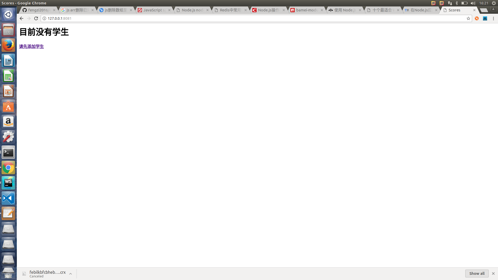
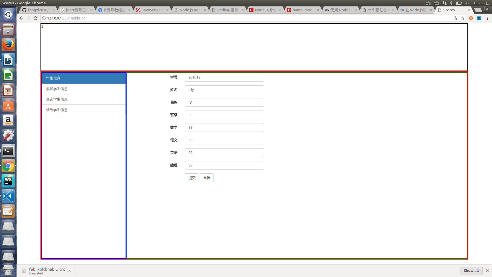
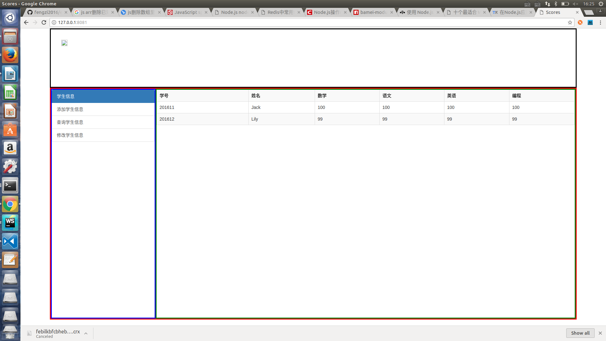
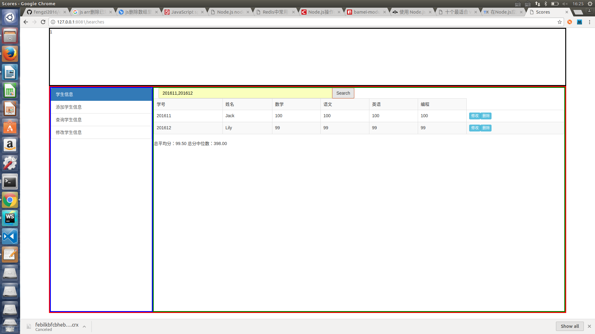

# 学生成绩单(API版本)

## 练习目标
  
	- 基于新需求，重构既有代码
	- REST API的简单设计
	- Express.js服务器的基本使用
	- Redis 数据储存的基本使用
	- 通过AJAX请求获取服务端数据
## 练习要求

使用[Express.js](http://www.runoob.com/nodejs/nodejs-express-framework.html)实现一个学生成绩管理系统的REST API服务器（以[Redis](https://www.w3cschool.cn/redis/)为数据存储），重构自己实现的[学生成绩单（Web版）](https://github.com/tws-practice/student-score-sheet-web-version)，以实现一个CS架构（Web端+服务端）的学生成绩管理系统，具有以下功能：

- 添加一条学生成绩信息
- 查询多个学生成绩信息
- 修改一条学生成绩信息
- 删除一条学生成绩信息

# PS:功能基本实现，但页面比较丑陋，欢迎吐槽

# 开始页面 

# 添加页面

# 展示页面

# 查询页面

# 其中删除和修改按钮都可以实现

	
